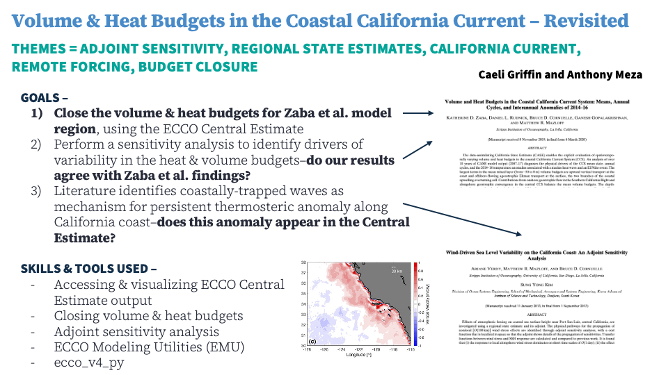

# Adjoint 	<ins>S</ins>ensitivities & 	<ins>H</ins>eat/Volume Budgets in 	<ins>E</ins>CCO for 	<ins>R</ins>egiona<ins>L</ins> Investigation 	<ins>O</ins>ver the 	<ins>C</ins>alifornia <ins>C</ins>urrent <ins>S</ins>ystem (SHERLOCCS)

## Introduction

We aim to understand the factors that control temperature variability in the CalCOFI region. Our work is heavily inspired by a previous 
study that used the California State Estimate (CASE) to probe this question [(Zaba et., al 2020)](https://doi.org/10.1175/JPO-D-19-0271.1). 
Here, we will use the central ECCO state estimate (currently ECCO V4r4) to achieve the following: 
- Investigate whether temperature anomalies that appear in CASE are reproduced in ECCO V4r4 
- Compare the heat/volume budgets of the CalCOFI region in ECCO V4r4 to the higher resolution CASE budgets
- Use the EMU toolbox to conduct an attribution study (i.e., attribute variability to winds, heat fluxes, etc.)
- Use the EMU toolbox to conduct an adjoint analysis, and to attribute observed temperature variability or extreme events to a particular mechanism  

### Collaborators

List all participants on the project. Here is a good space to share your personal goals for the hackweek and things you can help with.

| Name | Personal goals | Can help with | Role |
| ------------- | ------------- | ------------- | ------------- |
| Caeli Griffin | Practicing with EMU, improving understanding of regional state estimation, budget closure  | GitHub, MATLAB, positive attitude!  | Project Lead |
| Yue Wu | Understanding principles begind ECCO, practicing on LLC grid and EMU tool | Jupyter notebook, MATLAB, Gitgub | Project Lead |
| Anthony Meza | Learning adjoint capabilities using the EMU tool | GitHub, Jupyter, cloud computing, xarray, ECCO budgets | Project Lead |

## Data and Methods
We leveraged a variety of ECCO tools to investigate the science questions above, including the ECCO Modeling Utilities (EMU), adjoint sensitivity experiments, volume and heat budgets, perturbation experiments, and convolution experiments. 

### Data

ECCO Central Estimate --> ECCO Consortium. [2019]. [ECCO Version 4 Release 4]. Dataset accessed [2025-05-19] from [https://ecco-group.org/products.htm].

ECCO Modeling Utilities (EMU) --> https://ecco-group.org/docs/ecco_annual_mtg23_day1_04_fukumori.pdf

### Existing methods

How would you or others traditionally try to address this problem? Provide any relevant citations to prior work.

### Proposed methods/tools

What new approaches would you like to implement for addressing your specific question(s) or application(s)?

### Additional resources or background reading

Optional: links to manuscripts or technical documents providing background information, context, or other relevant information.

## Project goals and tasks

### Project goals

List the specific project goals or research questions you want to answer. Think about what outcomes or deliverables you'd like to create (e.g. a series of tutorial notebooks demonstrating how to work with a dataset, results of an anaysis to answer a science question, an example of applying a new analysis method, or a new python package).

* Goal 1
* Goal 2
* ...

### Tasks

What are the individual tasks or steps that need to be taken to achieve each of the project goals identified above? What are the skills that participants will need or will learn and practice to complete each of these tasks? Think about which tasks are dependent on prior tasks, or which tasks can be performed in parallel.

* Task 1 (all team members will learn to use GitHub)
* Task 2 (team members will use the scikit-learn python library)
  * Task 2a (assigned to team member A)
  * Task 2b (assigned to team member B)
* Task 3
* ...

## Project Results

[Untitled presentation.pdf](https://github.com/user-attachments/files/20535377/Untitled.presentation.pdf)

Use this section to briefly summarize your project results. This could take the form of describing the progress your team made to answering a research question, developing a tool or tutorial, interesting things found in exploring a new dataset, lessons learned for applying a new method, personal accomplishments of each team member, or anything else the team wants to share.

You could include figures or images here, links to notebooks or code elsewhere in the repository (such as in the [notebooks](notebooks/) folder), and information on how others can run your notebooks or code.
